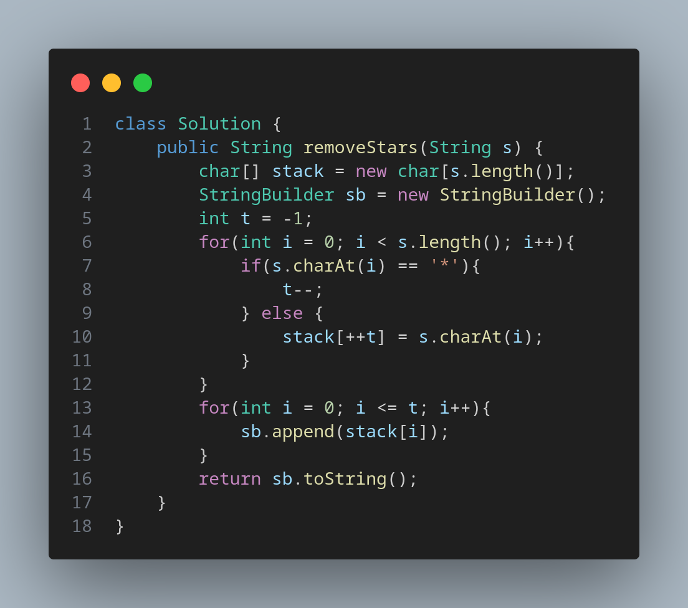

# [2390. Removing Stars From a String](https://leetcode.com/problems/removing-stars-from-a-string/)

Medium Stack

You are given a string s, which contains stars *.

In one operation, you can:

    Choose a star in s.
    Remove the closest non-star character to its left, as well as remove the star itself.

Return the string after all stars have been removed.

Note:

    The input will be generated such that the operation is always possible.
    It can be shown that the resulting string will always be unique.

    
    

