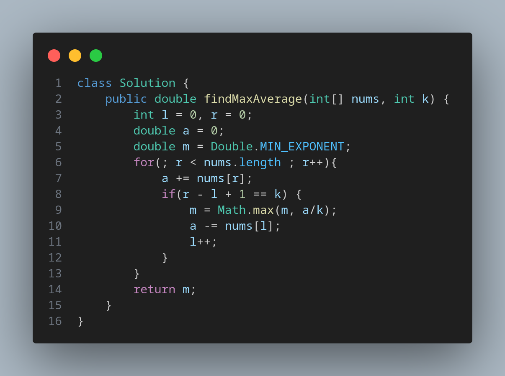

# [643. Maximum Average Subarray I](https://leetcode.com/problems/maximum-average-subarray-i/)

Easy Sliding Window

You are given an integer array nums consisting of n elements, and an integer k.

Find a contiguous subarray whose length is equal to k that has the maximum average value and return this value. Any answer with a calculation error less than 10-5 will be accepted.

    
    

