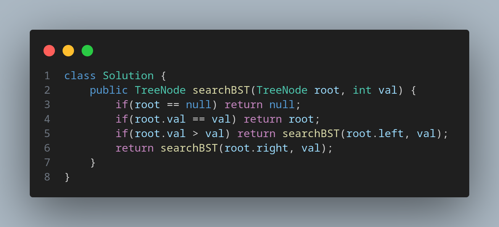

# [700. Search in a Binary Search Tree](https://leetcode.com/problems/search-in-a-binary-search-tree/)

Easy Binary Search Tree

You are given the root of a binary search tree (BST) and an integer val.

Find the node in the BST that the node's value equals val and return the subtree rooted with that node. If such a node does not exist, return null.

    
    

